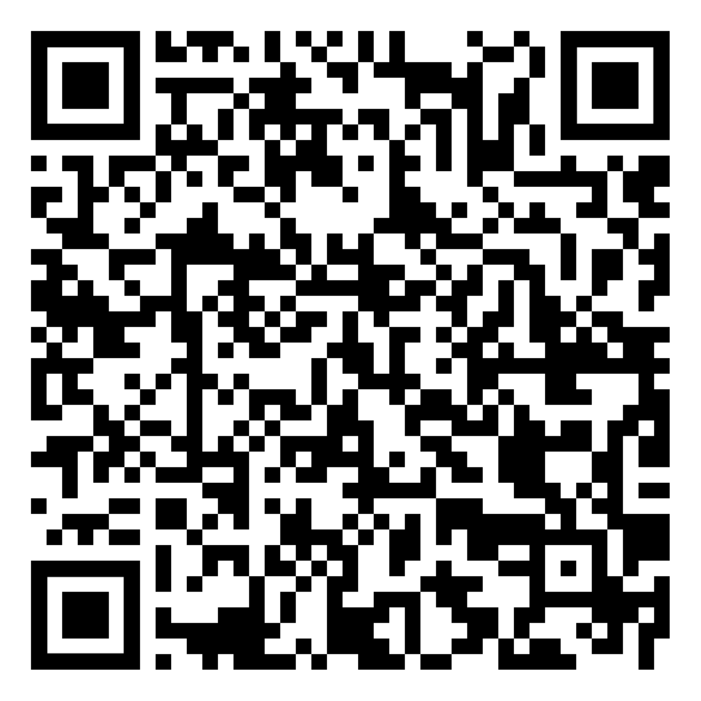

In this exercise, you can analyze the impact of the MO-TRNG parameters on blackbox statistical tests.

You can launch the Python application and observe how the duty cycle, the variance and the accumulation time affect the results of the 5 black box tests included in the AIS31 test suite (four of which are also included in the FIPS 140-1).

Your goal is to find the the smallest  for which the generated data would pass all five black box tests.

You should repeat the procedure for all possible  and  values.

